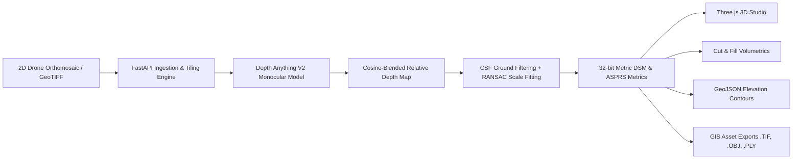

# DepthWizard 🧭⛰️

> **AI-Driven Monocular Elevation Estimation, Metric Calibration & Geospatial 3D Modeling Platform**

[](https://fastapi.tiangolo.com)
[](https://pytorch.org)
[](https://react.dev)
[](https://threejs.org)
[](https://opensource.org/licenses/MIT)

---

## 🌟 Overview

**DepthWizard** is an end-to-end geospatial intelligence and elevation modeling system that transforms single 2D aerial drone orthomosaics and satellite imagery into metric Digital Surface Models (DSMs), interactive 3D terrain meshes, and civil engineering volumetric analytics.

---

## 🚀 Key Features

### 1. 🧠 AI Monocular Depth Estimation
- Powered by **Depth Anything V2** (Vision Transformer ViT-S / ViT-B).
- **Seamless Tiling Engine**: Ingests high-resolution gigapixel orthomosaics with cosine-weighted overlap boundary blending to eliminate seam artifacts.

### 2. 📐 Metric Scale Calibration & Ground Separation
- **Cloth Simulation Filter (CSF)**: Inverted physics cloth simulation separating ground terrain from surface canopy and structural objects.
- **RANSAC Linear Regression**: Survey-grade scale fitting ($d = s \cdot D + t$) mapping relative AI disparity to real-world metric meters ($m$).
- **ASPRS Standard Accuracy Metrics**: Calculates **RMSE (Z)**, **MAE (Z)**, and **LE90** (Linear Error at 90% confidence) against Ground Control Points (GCPs).

### 3. 🌐 Interactive 3D Web Studio
- Built with **Three.js** and WebGL.
- Features real-time **OrbitControls**, vertical exaggeration ($0.5\times - 4.0\times$), wireframe inspection, topographic surface shading, and polygon diagnostics.

### 4. 📊 Earthwork & Volumetric Analytics
- **Cut & Fill Stockpile Calculations**: Computes excavation volume, backfill requirements, net earthwork balance ($m^3$), planar area, and true 3D sloped surface area ($m^2$).
- **RFC 7946 GeoJSON Vector Contours**: Extracts standard elevation isolines with customizable step intervals ($0.5m - 10m$).

### 5. 💾 Multi-Format GIS & 3D Exports
- **32-bit Metric GeoTIFF (.tif)**: Georeferenced floating point Digital Surface Model raster compatible with QGIS, ArcGIS, and Global Mapper.
- **Wavefront 3D Mesh (.obj)**: Analytical vertex normals with UV coordinate mapping.
- **Stanford Polygon (.ply)**: Point cloud / polygon mesh for CloudCompare and MeshLab.
- **GeoJSON Isolines (.geojson)**: Direct download of elevation contours.

---

## 🏗️ System Architecture



---

## 🛠️ Quickstart & Local Setup

### Prerequisites
- **Python 3.10+** (with `pip` and virtual environment support)
- **Node.js 18+** & **npm**

---

### 1. Backend Setup

```bash
# Clone the repository
git clone https://github.com/your-username/depthwizard.git
cd depthwizard

# Create and activate Python virtual environment
python -m venv .venv

# On Windows:
.venv\Scripts\activate
# On Linux/macOS:
# source .venv/bin/activate

# Install dependencies
pip install -r requirements.txt

# Configure environment
cp .env.example .env

# Run FastAPI backend server
uvicorn app.main:app --reload --host 127.0.0.1 --port 8000
```
API Documentation will be live at: **`http://127.0.0.1:8000/docs`**

---

### 2. Frontend Setup

```bash
# Open a new terminal in the frontend directory
cd frontend

# Install Node dependencies
npm install

# Start Vite development server
npm run dev
```
Frontend web studio will be live at: **`http://127.0.0.1:2727/`**

---

## 🧪 Running Automated Tests

DepthWizard includes a comprehensive 7-stage end-to-end integration test suite verifying authentication, raster ingestion, inference, CSF calibration, ASPRS accuracy, mesh generation, contours, and volumetrics:

```bash
# Run test suite
pytest tests/test_pipeline.py -v
```

---

## 📚 API Endpoints Summary

| Category | Method | Endpoint | Description |
|---|---|---|---|
| **Auth** | `POST` | `/auth/register` | Register new user account |
| **Auth** | `POST` | `/auth/login` | OAuth2 password token issuance |
| **Upload** | `POST` | `/api/v1/upload` | Ingest raster, extract CRS & tile grid |
| **Inference** | `POST` | `/api/v1/infer` | Run Depth Anything V2 with tile stitching |
| **Calibration**| `POST` | `/api/v1/calibrate` | CSF ground separation & RANSAC scale fitting |
| **Mesh** | `POST` | `/api/v1/export/mesh` | Generate 3D mesh (.obj, .ply) |
| **Mesh** | `GET` | `/api/v1/export/mesh/download` | Download 3D mesh binary |
| **GeoTIFF** | `GET` | `/api/v1/export/geotiff` | Download 32-bit floating point metric DSM |
| **Contours** | `POST` | `/api/v1/export/contours` | Generate RFC 7946 GeoJSON contour lines |
| **Volume** | `POST` | `/api/v1/export/volume` | Cut & Fill earthwork volumetric computation |

---

## 📄 License

Distributed under the **MIT License**. See [`LICENSE`](./LICENSE) for details.
